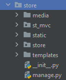
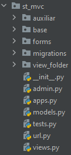
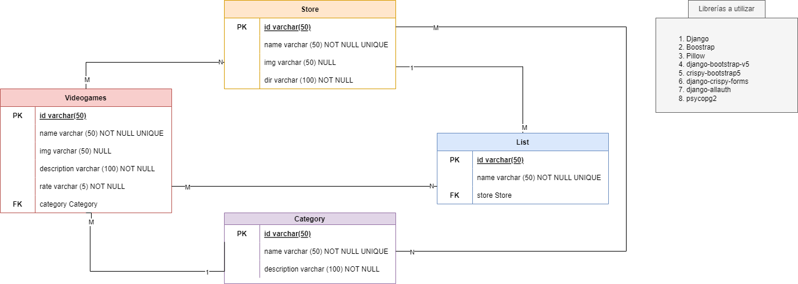

# Tutorial Django

Este proyecto utiliza el entorno virtual `pipenv`. Este nos permite llevar un control de los paquetes que instalemos dentro de nuestra aplicación y sus versiones. Además, crea una carpeta dentro del usuario de la computadora con los paquetes descargados solamente para la aplicación actual; de esta forma podemos evitar conflictos entre aplicaciones.

- Para instalar y conocer pipenv puede dirigirse a este link:
  - https://pypi.org/project/pipenv/
- Para instalar las dependencias de este proyecto use el siguietne comando:
  - `pipenv install`
- Si queremos ver los paquetes que se van a instalar
  - Accedemos a `Pipfile`

# Antes de comenzar

Antes de explicar en que consiste este reposiorio, creo que no estaría de más explicar la estructura del mismo. El proyecto se llama `store` y su objetivo lo podemos ver en la `Parte 2` de este documento. Dentro poseemos la estructura básica de una aplicación Django:

**Estructura inicial**

- `media`: Todas las fotos subidas, se almacenarán en esta carpeta. 
  - De ser posible usen [Minio](https://min.io/) y no una carpeta dentro del proyecto
- `st_mvc`: Aplicación de django creada
- `static`: Almacena todos los archivos js, css e imágenes de la app. En general todos los archivos estáticos.
- `store`: Esta carpeta contiene todos los datos correspondientes a la configuración del sitio. Los archivos más importantes están aqui.
- `tempaltes`: Esto es propio del desarrollo actual. Aquí almacenaremos todas las plantillas de la app.

**Carpeta st_mvc**

- `auxiliar`: En esta carpeta tendrá todos los datos auxiliares para la aplicación. Diganse funciones, constantes, etc.
- `base`: Almacena clases de las que se heredarán. Actualmente posee las clases bases para los modelos.
- `forms`: Contiene todos los formularios de la app.
- `migrations`: Cuando creemos migraciones con django, se almacenarán aqui.
- `view_folder`: En nuestro caso dividimos los `view` por cada modelo. Por lo que debemos cear una carpeta que los contenga todos.
- `archivos básicos`: Estos son los demás archivos generados por Django para trabajar.

Conciendo la estructura de nuestro trabajo, podemos comenzar a trabajar en el tutorial:

## Parte 1

En esta parte del tutorial estaremos abordando varios temas globales del framework Django. Entre los temas que se estarán abordando se encuentran:
- Formularios.
- Vistas genéricas en Django.
- Llamadas a servicios externos
- Pruebas. DDT.
- Autenticación
- Websocket.

Es importante aclarar que en esta parte no estaremos siguiendo una problemática en específico, simplemente probaremos las diferentes formas de conseguir cumplir los objetivos anteriormente expuestos. Una documentación más detallada de este tema la pueden encontrar en [Django Tuto](https://github.com/BadiaValdes/docs/blob/doc/python/django.obj3.md). 

Todos los códigos correspondientes a este apartado se encontrarán en la rama **`feat/working-around`**

## Parte 2

En este apartado veremos como crear una aplicación sencilla con todo lo visto en el tutorial del objetivo 3. La aplicación consiste en una cadena de tiendas de videojuegos. Solo nos concentraremos en la lógica de los CRUDS de las tiendas y sus productos. El carrito de compra será un sistema dummy que usará `webSocket` para el intercambio de información, pero no poseerá validaciones ni tabla propia en el backend. A continuación mostramos un diagrama del sistema que vamos a desarrollar:

La información que muestra paso a paso como hacer este proyecto, la puede encontrar en [Django Tuto](https://github.com/BadiaValdes/docs/blob/doc/python/django.obj3.test.md)

La rama que contendrá la aplicación principal se llamará **`dev`**

## Extra

Como extra puede ver el proyecto [Django Code Farm](https://github.com/BadiaValdes/DjangoCodeFarm). Dentro encontrará varios proyectos creados con la intención de probar el framework. No posee una estructura finja, por lo que puede ser un poco confuso, pero dentro encontrará desde trabajo básico con `Django` hasta `WebSocket`. Es un proyecto un poco viejo, pero se puede tomar de guía para el desarrollo desde cero de una aplicación.
